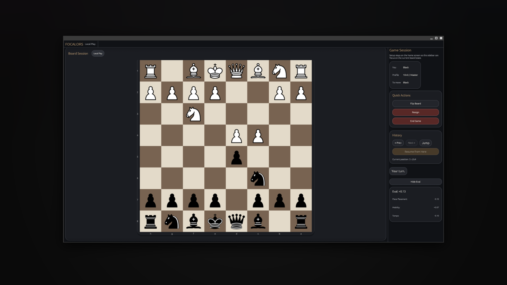
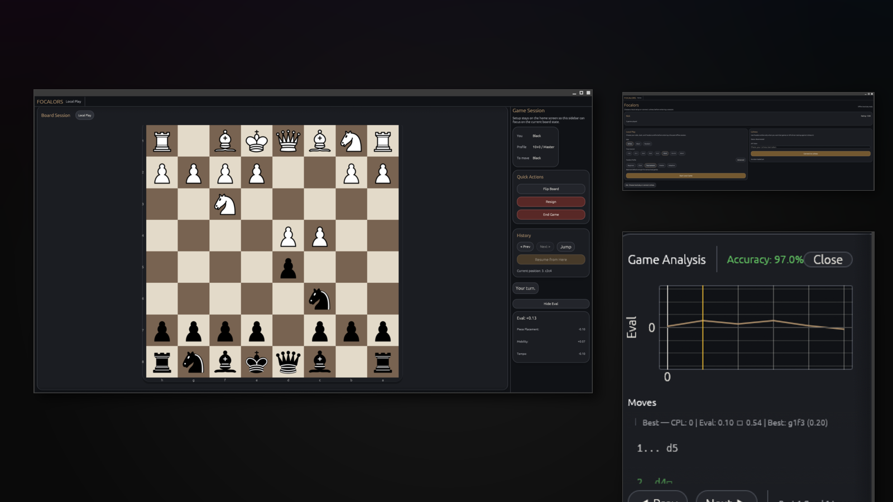

# Focalors

Focalors (formerly named Hydra/HydraProject during initial development) is an offline-first chess engine and learning platform written in Rust. It combines local play, post-game analysis, puzzles, statistics, and engine tooling in a single project that runs without cloud services or an external database.

- Play full local games against an adjustable engine, including an adaptive difficulty mode
- Review finished games with move classifications, accuracy, an eval graph, and human-readable explanations
- Train on puzzles extracted from your own mistakes
- Track rating, openings, and long-term progress in a local SQLite database
- Run the same engine through the desktop GUI, UCI, or a Lichess bot mode



## Start Here

Build the project and launch the desktop app:

```bash
cargo build --release
cargo run --release -- gui
```

The optimized binary will be available at `target/release/focalors`.

Need the engine architecture, NNUE notes, and training commands? See [docs/TECHNICAL.md](docs/TECHNICAL.md).

### Main Commands

| Command | Purpose |
| --- | --- |
| `cargo run --release -- gui` | Launch the desktop GUI for local play, analysis, puzzles, and stats |
| `cargo run --release -- uci` | Run Focalors as a standard UCI engine |
| `cargo run --release` | Same as `uci` |
| `cargo run --release -- lichess` | Run the headless Lichess bot |
| `cargo test` | Run the full test suite |
| `cargo build --release` | Build the optimized binary |

If you want to use Lichess mode, create a `.env` file with your bot token:

```bash
printf "LICHESS_TOKEN=your_token_here\n" > .env
cargo run --release -- lichess
```

## What Focalors Does Today

Focalors is already usable as both a chess engine and a learning app.

- **Local play**: full games in the GUI with clocks, promotion handling, resign, rewind, move history, and multiple strength presets
- **Profiles and persistence**: local SQLite storage for player profile, rating, saved games, openings, move analysis, and puzzles
- **Post-game review**: move classification, accuracy scoring, eval graph, and explanations of what changed in the position
- **Training and coaching**: puzzle extraction from blunders, a puzzle trainer, opening statistics, coaching summaries, and a statistics dashboard
- **Engine interfaces**: desktop GUI, UCI mode, and a Lichess bot path
- **Engine development**: self-play data generation, NNUE training, network promotion, and HCE tuning tools

## Interface Preview



## Technical Overview

Focalors uses a dual-evaluation design.

- **NNUE** is used during search for playing strength.
- **HCE** is kept alongside it for interpretation, so analysis can explain *why* a move or position was good or bad.

That split is the core idea behind the project: strong play and readable feedback in the same codebase.

For the source layout, engine internals, and development commands, see [docs/TECHNICAL.md](docs/TECHNICAL.md).

## Learn More

- [docs/TECHNICAL.md](docs/TECHNICAL.md) covers architecture, source layout, evaluation design, and engine-development commands.
- [CONTRIBUTING.md](CONTRIBUTING.md) covers contributor workflow, build expectations, and development notes.

## Planned Next

The near-term product roadmap is focused on expanding the chess and learning experience rather than changing the core identity of the project.

- **Chess960 and variants**: support for Fischer Random and variant-aware castling rules
- **Stronger future NNUE generations**: more self-play data, improved training cycles, and stronger default networks
- **Engine knowledge improvements**: better opening behavior, deeper endgame handling, and continued search/eval refinement
- **Richer review tools**: deeper replay and coaching improvements on top of the current analysis pipeline

## Contributing

Focalors is meant to be approachable for both engine work and application work. If you want to contribute, start with [CONTRIBUTING.md](CONTRIBUTING.md) for the practical workflow.

## License

Focalors is licensed under GPL-3.0-or-later.
