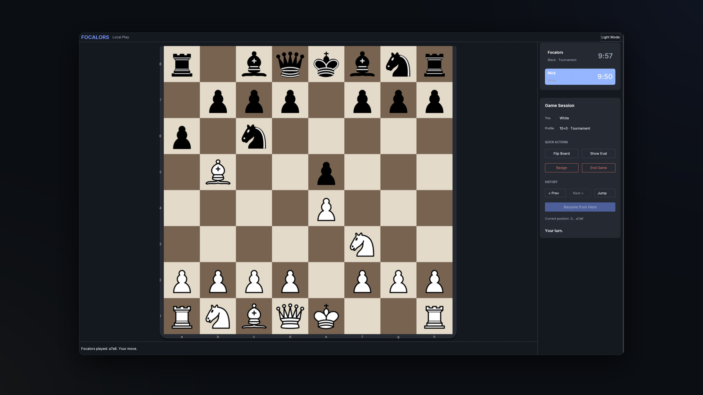
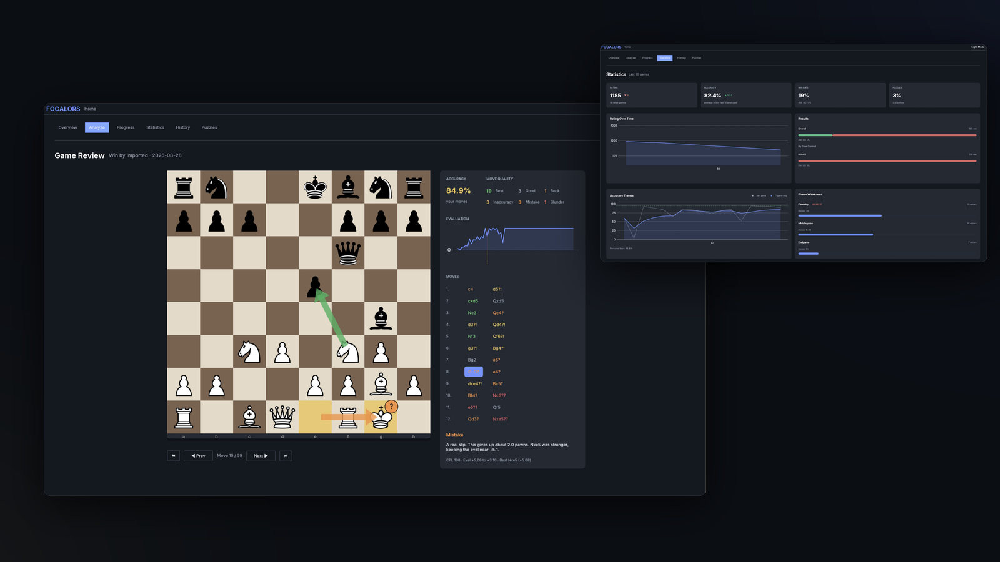

# Focalors

Focalors is a chess engine and learning app I built in Rust. It runs entirely offline - local play against the engine, post-game review with explanations, puzzles drawn from your own mistakes, and a stats view that lives in a small SQLite file on your machine. No accounts, no cloud, no telemetry.



The thing I wanted to figure out is whether you can have both a strong engine *and* readable explanations of what it's doing. Most engines optimize one or the other. Focalors keeps two evaluations side by side: an NNUE network drives playing strength during search, and a hand-crafted evaluation runs alongside it whenever the app needs to explain *why* a move was bad - a hanging piece, a worsening pawn structure, lost king safety. The same core powers the desktop GUI and a standard UCI engine for other front-ends.



## Elo 2200-2400~? (And why it's not (very) important)
My goal is a full chess learning experience without a permanent internet connection or a subscription - your games, data and progress live on your machine, always accessible. Focalors does not aim to compete with state-of-the-art engines like Stockfish. It just needs to be strong enough to teach human understandable positions and help average players, advanced ones, and possibly even masters improve. (With the sole exception of Satoru Gojo aka Magnus Carlsen) I love chess and wanna do a small contribution to people trying to get further into the game.

## The net trains itself

The part I'm quietly proud of: the entire NNUE training pipeline lives in this repo, written from scratch - the self-play data generator, both trainers (CPU and GPU), and the statistical promotion gate. No bullet, no external trainer. The engine plays a hundred thousand games against itself, a candidate net trains on those games, and it only replaces the current net if it wins a long head-to-head match. The very first net was trained from scratch right here; [Luc Vedrenne](https://github.com/ListIndexOutOfRange) then contributed ten generations of fine-tuning on top (roughly +270 elo, see [CREDITS.md](CREDITS.md)), and every generation since is trained in-house again. How the loop works: [docs/TECHNICAL.md](docs/TECHNICAL.md).

## Running it

The simplest path is to grab a prebuilt binary from the [Releases page](https://github.com/Inuway/Focalors/releases) - Linux, macOS, and Windows builds are attached to each tagged release. Run the binary and the GUI opens.

If you'd rather build from source you'll need a Rust toolchain, then:

```bash
cargo build --release
./target/release/focalors gui
```

If you want to plug Focalors into another chess GUI, `focalors uci` runs the standard UCI protocol on stdio.

## Where to dig in

[docs/TECHNICAL.md](docs/TECHNICAL.md) has the engine internals, evaluation design, and the NNUE training workflow. [CONTRIBUTING.md](CONTRIBUTING.md) has the practical workflow if you want to send a patch.

## License

GPL-3.0-or-later. The chess piece graphics in [`assets/pieces/`](assets/pieces/) are CC BY-SA 3.0 by Colin M.L. Burnett - see [CREDITS.md](CREDITS.md) for the full attribution.
